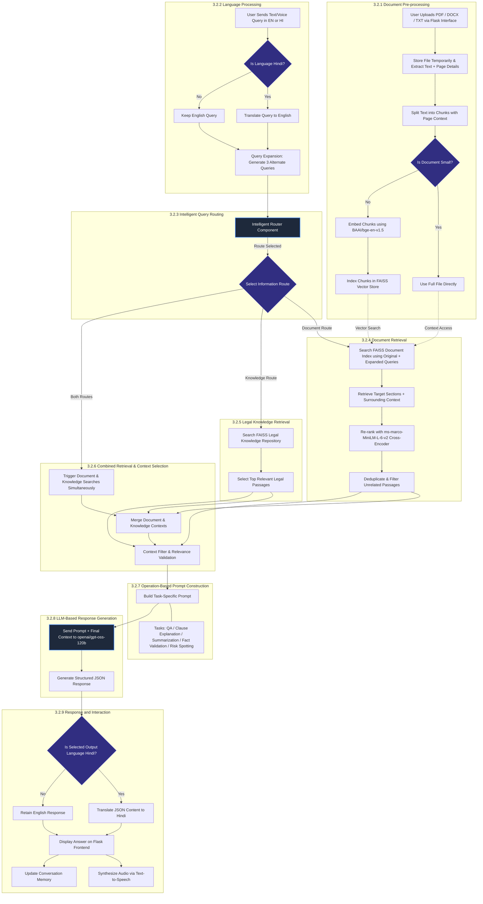

```mermaid
graph TD
    %% Section 3.2.1: Document Pre-processing
    subgraph S1["3.2.1 Document Pre-processing"]
        A[User Uploads PDF / DOCX / TXT via Flask Interface] --> B[Store File Temporarily & Extract Text + Page Details]
        B --> C[Split Text into Chunks with Page Context]
        C --> D{Is Document Small?}
        D -- Yes --> E[Use Full File Directly]
        D -- No --> F[Embed Chunks using BAAI/bge-en-v1.5]
        F --> G[Index Chunks in FAISS Vector Store]
    end

    %% Section 3.2.2: Language Processing
    subgraph S2["3.2.2 Language Processing"]
        H[User Sends Text/Voice Query in EN or HI] --> I{Is Language Hindi?}
        I -- Yes --> J[Translate Query to English]
        I -- No --> K[Keep English Query]
        J --> L[Query Expansion: Generate 3 Alternate Queries]
        K --> L
    end

    %% Section 3.2.3: Intelligent Query Routing
    subgraph S3["3.2.3 Intelligent Query Routing"]
        L --> M[Intelligent Router Component]
        M -->|Route Selected| N{Select Information Route}
    end

    %% Section 3.2.4: Document Retrieval
    subgraph S4["3.2.4 Document Retrieval"]
        N -->|Document Route| O[Search FAISS Document Index using Original + Expanded Queries]
        E -.->|Context Access| O
        G -.->|Vector Search| O
        O --> P[Retrieve Target Sections + Surrounding Context]
        P --> Q[Re-rank with ms-marco-MiniLM-L-6-v2 Cross-Encoder]
        Q --> R[Deduplicate & Filter Unrelated Passages]
    end

    %% Section 3.2.5: Legal Knowledge Retrieval
    subgraph S5["3.2.5 Legal Knowledge Retrieval"]
        N -->|Knowledge Route| S[Search FAISS Legal Knowledge Repository]
        S --> T[Select Top Relevant Legal Passages]
    end

    %% Section 3.2.6: Combined Retrieval
    subgraph S6["3.2.6 Combined Retrieval & Context Selection"]
        N -->|Both Routes| U[Trigger Document & Knowledge Searches Simultaneously]
        R --> V[Merge Document & Knowledge Contexts]
        T --> V
        U --> V
        V --> W[Context Filter & Relevance Validation]
    end

    %% Aligning outputs from single routes
    R --> W
    T --> W

    %% Section 3.2.7: Prompt Construction
    subgraph S7["3.2.7 Operation-Based Prompt Construction"]
        W --> X[Build Task-Specific Prompt]
        X --- X1["Tasks: QA / Clause Explanation / Summarization / Fact Validation / Risk Spotting"]
    end

    %% Section 3.2.8: LLM-Based Response Generation
    subgraph S8["3.2.8 LLM-Based Response Generation"]
        X --> Y[Send Prompt + Final Context to openai/gpt-oss-120b]
        Y --> Z[Generate Structured JSON Response]
    end

    %% Section 3.2.9: Response and Interaction
    subgraph S9["3.2.9 Response and Interaction"]
        Z --> AA{Is Selected Output Language Hindi?}
        AA -- Yes --> AB[Translate JSON Content to Hindi]
        AA -- No --> AC[Retain English Response]
        AB --> AD[Display Answer on Flask Frontend]
        AC --> AD
        AD --> AE[Synthesize Audio via Text-to-Speech]
        AD --> AF[Update Conversation Memory]
    end

    %% Styling / Aesthetics
    classDef primary fill:#1e293b,stroke:#3b82f6,stroke-width:2px,color:#fff;
    classDef process fill:#0f172a,stroke:#475569,stroke-width:1px,color:#e2e8f0;
    classDef decision fill:#312e81,stroke:#6366f1,stroke-width:1px,color:#fff;
    
    class M,Y primary;
    class D,I,N,AA decision;
```
